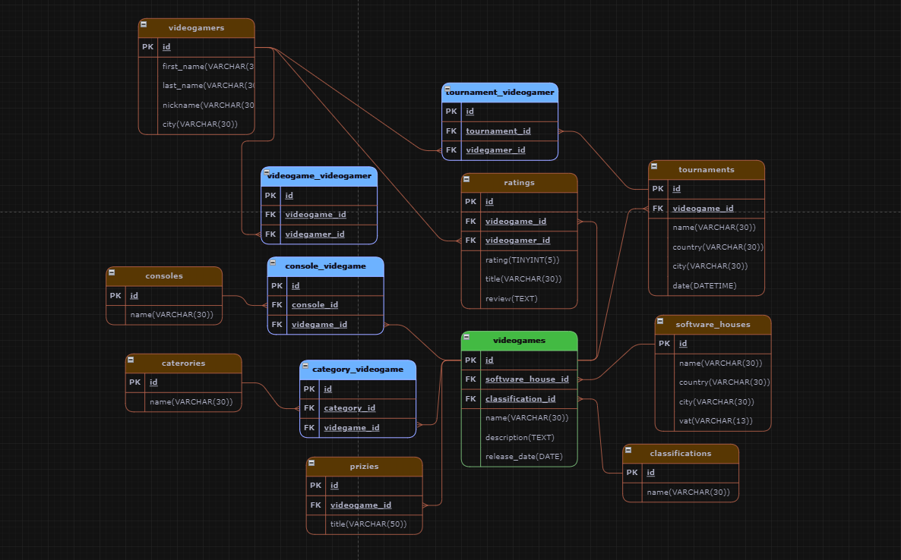
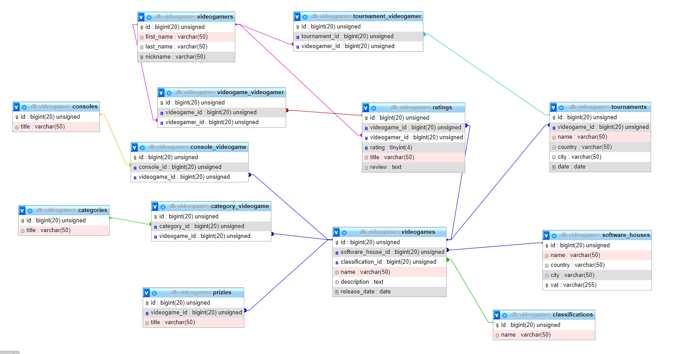

# db-videogames

Esercizio di oggi: db-videogames
## Esercizio
Creare lo schema e-r con tutte le entità necessarie a gestire le informazioni di un archivio di E-sports. (https://www.drawio.com/)

Ciascun videogame ha un nome, una trama, una data di rilascio ed è prodotto da una software house, la quale, a sua volta, è identificata da un nome, una partita iva, città e nazione.

I videogames possono essere disponibili su diverse piattaforme (PlayStation 4, PlayStation 5, XBox One, XBox Serie X, Windows, Nintendo Switch, Google Stadia, ...) e hanno diverse categorie (avventura, strategia, RPG, sparatutto, calcio, ...) e classificazioni PEGI (PEGI 7, PEGI 12, PEGI 18, Violenza, Paura, Gioco d'azzardo, ...)
Periodicamente, vengono organizzati dei tornei a cui possono partecipare tutti i videogiocatori del mondo.

Ogni torneo è caratterizzato da un nome, l'anno e la città in cui si svolge. I giocatori, al momento dell'iscrizione, devono fornire nome, cognome, nickname di gioco, e città di provenienza.

I videogames possono essere recensiti dai giocatori, i quali oltre al titolo e al testo, possono valutare i videogame con un rating da 1 a 5.

Ogni anno vengono votati i migliori videogiochi, che possono così vincere diversi premi (gioco dell'anno, miglior narrativa, miglior colonna sonora, miglior gioco indipendente, gioco più atteso, ...)

---
